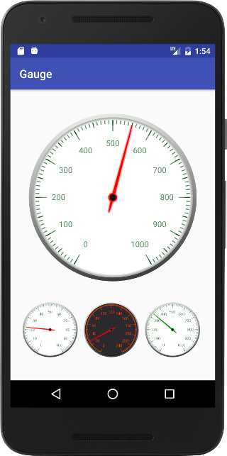

# Gauge
A Gauge View for Android

[](https://jitpack.io/#Pygmalion69/Gauge) [](https://travis-ci.org/Pygmalion69/Gauge)



See my [blog post](http://pygmalion.nitri.de/android-gauge-view-1039.html) for a brief introduction.

### Example

```xml
<de.nitri.gauge.Gauge
            android:id="@+id/gauge"
            android:layout_width="wrap_content"
            android:layout_height="wrap_content"
            android:layout_gravity="center"
            android:layout_marginTop="10dp"
            gauge:initialValue="22"
            gauge:maxValue="100"
            gauge:minValue="0"
            gauge:totalNicks="120"
            gauge:valuePerNick="1" />
```

### XML attributes
#### totalNicks
Total number of nicks on a full 360 degree scale.
#### valuePerNick
Float value (interval) per nick.
#### majorNickInterval
Integer interval (number of nicks) between enlarged nicks.

*Note that there is always a major nick on top, that is at 0 degrees, so
it is advisable that the sum of the min and max value be divisible by 2.*

#### minValue
Float minimum value.
#### maxValue
Float maximum value.
#### intScale
Boolean for an integer scale (defaults to true).
#### initialValue
Float initial value.
#### labelTextSize
Float text size for the number labels (defaults to a calculated value).
#### faceColor
Integer face color.
#### scaleColor
Integer scale color.
#### needleColor
Integer needle color.
#### needleShadow
Boolean to apply a shadow effect to the needle (defaults to true).
#### upperText
String to display on upper gauge face (e.g. a quantity).
#### lowerText
String to display on lower gauge face (e.g. a unit).
#### textSize
Float text size for upper and lower text.

### Public methods
#### void setValue(float value)
Set gauge to value.
#### void moveToValue(float value)
Animate gauge to value.
#### void setUpperText(String text)
Set string to display on upper gauge face.
#### void setLowerText(String text)
Set string to display on lower gauge face.
#### void setDeltaTimeInterval(int value)
Set the delta time between movement steps during needle animation (default: 5 ms).
#### void setNeedleStepFactor(float value)
Set the factor that determines the step size during needle animation (default: 3f).
The actual step size is calulated as follows: step_size = step_factor * scale_value_per_degree.

### Javadoc
[http://pygmalion.nitri.org/javadoc/gauge/](http://pygmalion.nitri.org/javadoc/gauge/)


### Gradle

Add the JitPack repository in your root build.gradle at the end of repositories:

```
repositories {
    maven {
        url 'https://www.jitpack.io'
    }
}
```

Add the dependency:

```
dependencies {
    compile 'com.github.Pygmalion69:Gauge:1.2.3'
}
```

### App implementing this view

[ErsaAndroid](https://github.com/Pygmalion69/ErsaAndroid)
